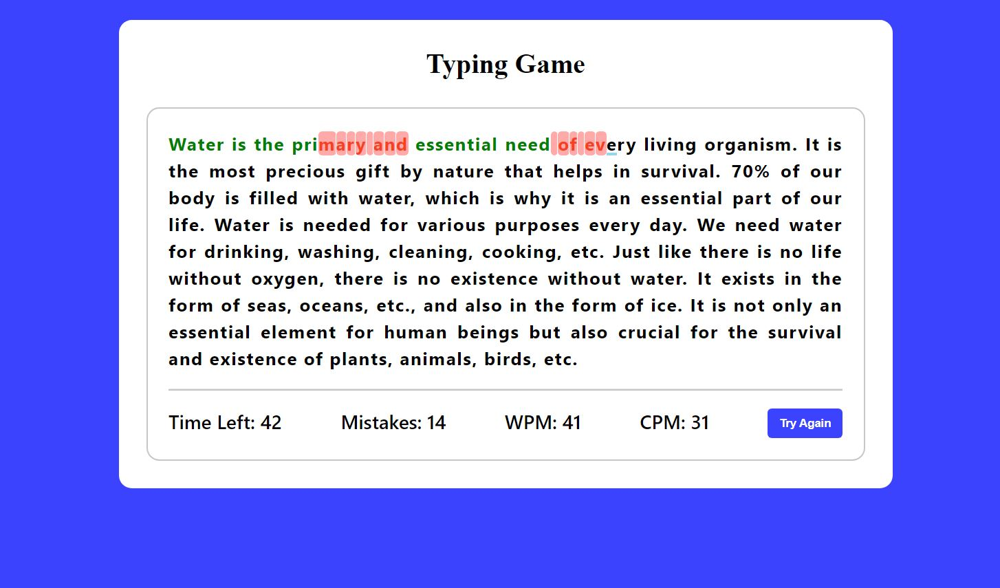

# ⭐ Project - Typing Game ⭐

This  project of javascript is made from pure HTML,CSS and Javascript.

I got this assignment from iNeuron Bootcamp.

 

📌 Learnings:

👉 1\. Event Listeners and DOM Manipulation 
👉 2\. How to create timer of 60sec, how to count words and characters per minute.  
👉 3\. How to add and remove classes when events triggered. 
👉 4\. setInterval() and conditionals 
👉 5\. Broke complete projects into small fragments and solve each one by one.  

 

> Time taken to build this project is 3 hr.

  

## Links

[Link](.netlify.app)

[Linkedin](https://www.linkedin.com/in/pratyush-kesarwani-2b6601171/)

### Acknowledgements:

I am thankful to Hitesh Choudhary sir, Anurag sir and iNeuron team for this amazing bootcamp.
